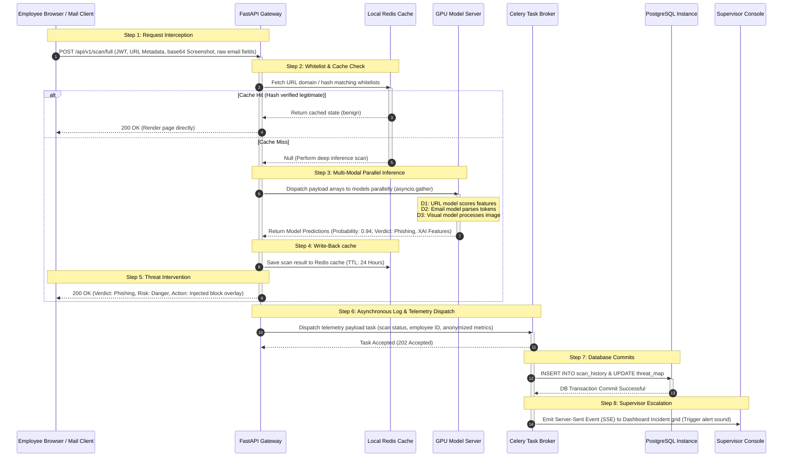
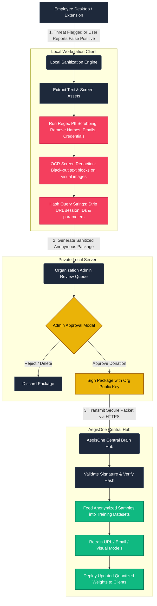
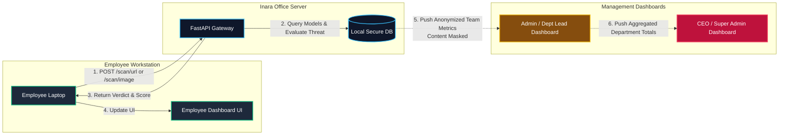

# AegisOne: Detailed Diagram Generation Prompts

This document provides production-ready, highly detailed visual prompt structures for AI diagram generation engines (such as **Eraser.io**, **Mermaid.js**, **PlantUML**, or **DALL-E 3**). Each prompt is structured with explicit layout rules, node coordinate logic, color tokens, and directional vector pathways.

---

## 🎨 Diagram 1: High-Level System Architecture (HLD)

### Prompt for Eraser.io or Diagram GPT Engines
```text
Create a vertical, multi-layered enterprise system architecture diagram for "AegisOne Phishing Prevention System". Use a dark cyber-defense theme with deep navy backgrounds (#0b0f19), neon cyan borders (#06b6d4) for secure traffic, deep orange borders (#f97316) for threat routes, and dark grey fills (#1e293b) for components.

Structure the diagram into 5 horizontal zones (from top to bottom):

ZONE 1: CLIENT WORKSTATION ENDPOINTS
- Group Box labeled "User Workstation (Laptops & Desktops)" containing:
  - Component A1: "Chrome Browser Extension" (with sub-labels: Manifest V3 Background Worker, Content Script DOM Parser, CSS Overlay Injector).
  - Component A2: "Email Client Add-ins" (with sub-labels: Google Workspace Apps Script, Outlook OfficeJS Taskpane).
  - Component A3: "Desktop Agent" (with sub-labels: OS Window Handler Scanner, Local Network Loopback Proxy).

ZONE 2: API ROUTING & GATEWAY
- Draw a broad, centered horizontal container labeled "FastAPI Gateway Cluster" containing:
  - Component B1: "JWT & API Key Authenticator"
  - Component B2: "Rate Limiting & Payload Sanitizer"
  - Component B3: "API Router & Model Orchestrator (asyncio.gather)"
- Place a database icon labeled "Redis Key-Value Cache" to the immediate left of the Gateway.
- Place an envelope icon labeled "Celery Telemetry Queue" to the immediate right of the Gateway.

ZONE 3: CLIENT-SIDE LOCAL DATA LAYER (IN-HOUSE)
- Draw a double-line container labeled "Client In-House Private DB Node" containing:
  - Component C1: "PostgreSQL Database Engine" (Sub-tables: Organization roster, employee settings, local scan history logs, active incident queues).
  - Component C2: "Redis Database Engine" (Sub-tables: Whitelisted domains, pre-evaluated secure link hashes).

ZONE 4: AI INFERENCE CLUSTER
- Draw a container labeled "GPU Inference Node" containing three parallel pipelines:
  - Pipeline D1: "URL Model" (BERT + Feature MLP Classifier)
  - Pipeline D2: "Email Model" (DistilBERT + LoRA + Bi-LSTM + Multi-Head Attention Pool)
  - Pipeline D3: "Visual Model" (EfficientNet-B3 + custom Dense Head + SE Attention Block)

ZONE 5: AEGISONE CENTRAL OPERATIONS
- Draw a container labeled "AegisOne Developer Central Hub" containing:
  - Component E1: "Global Analytics Panel" (Platform-wide scan counts, model accuracy logs)
  - Component E2: "Operator Help Desk & Ticket Support"

CONNECTION AND DIRECTION FLOW RULES:
- Connect User Workstation (A1, A2, A3) to FastAPI Gateway (B2) with solid lines containing the label "HTTPS JSON telemetry / Base64 Screenshots".
- Connect FastAPI Gateway (B3) to Redis Cache with a bi-directional line labeled "URL Hash Lookup (2ms)".
- Connect FastAPI Gateway (B3) to AI Inference Cluster (D1, D2, D3) with solid line arrows labeled "Parallel Model Input (asyncio.gather)".
- Connect Celery Queue to PostgreSQL Database (C1) with a dashed line arrow labeled "Asynchronous telemetry insert".
- Connect FastAPI Gateway (B3) to PostgreSQL Database (C1) directly with a solid line labeled "JWT query / Admin settings".
- Connect PostgreSQL Database (C1) to AegisOne Developer Central Hub (E1) with a dashed line labeled "Aggregated metrics only (Anonymized counts)".
- Connect Client In-House settings (C1) to AegisOne Operator Support (E2) with a bi-directional line labeled "Secure Ticket Exchange / Bug Reports".
```

---

## 🔄 Diagram 2: Low-Level Orchestration & API Flow (LLD)

### Prompt for Mermaid.js Sequence Parser


---

## 🔒 Diagram 3: Non-Transparent Data Privacy & Access Grid

### Prompt for Diagram Visualizer
```text
Draw a hierarchical access control grid and privacy separation diagram for "AegisOne Corporate Data Boundaries". Use clean rectangular boxes with color coding: Neon green (#10b981) for open access, yellow (#f59e0b) for masked view, and solid red (#ef4444) for strict privacy blockades.

Layout a three-tiered user box grid, top to bottom:

TIER 1: GLOBAL PLATFORM OPERATIONS (AegisOne Developers)
- Component Box: "Developer Operations Portal"
- Connected to: "Global Analytics Database"
- Security Blockade: Draw a thick red brick-pattern wall separating the developer zone from the organization's private directories. Label the wall "Strict SaaS Content Masking".
- Analytics Pipeline: Draw a green pipe passing through the wall. Label it "Total scan counts, error logs, accuracy metrics only (NO PII, NO TEXTS)".

TIER 2: SUPERVISOR & HIGH-LEVEL MANAGEMENT (Tenant Admins)
- Component Box: "Supervisor Risk Dashboard"
- Connected to: "Department Team Directory"
- Security Blockade: Draw a yellow dashed line separating the supervisor zone from the employee workstations. Label it "Employee Content Shield".
- Threat Reporting Pipeline: Draw a yellow arrow labeled "Anonymized Threat Event Logs (Employee name, timestamp, blocked indicator. Content is completely hidden)".

TIER 3: EMPLOYEE SYSTEMS (End Users)
- Group Box: "Employee Workstations & Local Laptops" containing:
  - Sub-Component: "Personal Scan History Log"
  - Sub-Component: "Raw Incoming Email Bodies & Screen Telemetry"
- Access Scope: Draw a green double-headed arrow between the employee profile and these sub-components. Label it "Full Transparency (Personal Scans only)".

EXPLICIT PRIVACY VISUAL RULES:
- Draw a magnifying glass looking at the "Incoming Email Bodies & Screen Telemetry" component inside Tier 3. Draw a red line crossing out the magnifying glass from Tier 2 (Supervisor) and Tier 1 (Developer).
- Draw a lock icon on "PostgreSQL Tenant Database" to indicate in-house data locking.
```

---

## 📥 Diagram 4: Secure Data Donation Protocol

### Prompt for Mermaid.js Flowchart Engine


---

## 🏙️ Diagram 5: Islamabad City Network & Corporate Tenant Hierarchy

This diagram represents the conceptual layout of the AegisOne ecosystem deployed across multiple client organizations within a central geographic city ("Islamabad"). It maps the communication channels showing that the developer organization ("AegisOne") interacts exclusively with the Tenant Super Admins to receive anonymized analytics, maintaining absolute internal privacy.

### Option A: 3D Isometric Illustration Prompt (For DALL-E 3 / Midjourney)
> **Prompt**: 
> "A 3D isometric vector illustration of a modern smart city grid named 'Islamabad'. In the center of the grid is a small developer headquarters labeled 'AegisOne Tech Hub' glowing with cyan light. Scattered around the city grid are five tall commercial skyscrapers representing different client companies (labeled U Bank, Inara, Apex Corp, and others). 
> Each skyscraper is semi-transparent, showing a three-tiered corporate structure inside: 
> 1. Top Tier: A executive board room labeled 'Super Admin (CEO/IT Head)' in gold.
> 2. Middle Tier: Multiple office sections labeled 'Admins / Department Heads' in orange.
> 3. Bottom Tier: Workstations showing employees working on laptops and desktops with green security shields.
> Thin, glowing golden data fiber pipelines run underground from the 'Super Admin' boardroom of each skyscraper to the central 'AegisOne Tech Hub', representing 'Anonymized Analytics'. Thick red warning lights flash locally at the base of the skyscrapers to represent 'Local Private Blocks'. High-tech, minimalist cyber-security theme, dark mode, high contrast, clean vector style."

### Option B: Topology Structure Prompt (For Eraser.io / Diagram GPT)
```text
Create an isometric city map and organization topology diagram representing "AegisOne Islamabad Multi-Tenant Topology". 

Draw a layout containing:
1. Centered Core Node: "AegisOne Developer Office (Dev Core)"
2. Five Satellite Nodes surrounding the core representing the client offices:
   - Node 1: "U Bank Office Tower"
   - Node 2: "INARA Technologies HQ"
   - Node 3: "Apex Financial Tower"
   - Node 4: "Telecom House"
   - Node 5: "Federal Grid Office"

Each client office node must contain a nested vertical tree indicating the internal hierarchy:
   - Level 1 (Top): "Super Admin" (Executive tier, controls local policies, whitelists, local DB servers).
   - Level 2 (Middle): "Department Admins / Supervisors" (Team leads, monitors department active shield status, reviews anonymized risk logs).
   - Level 3 (Bottom): "Employees" (Endpoint users on laptops and desktops running browser extensions and email plugins).

CONNECTION AND INTERACTION PIPELINES:
- Draw a double-line security border around each client office node. Label the border "Corporate Intranet Perimeter".
- Connect the "Employees" node to the local "Department Admins" node. Label it "Local Incident Escalation".
- Connect "Department Admins" to the local "Super Admin". Label it "Aggregated Department Statistics".
- Draw a single dashed line from each client's "Super Admin" node directly to the "AegisOne Developer Office". Label the line "SaaS Aggregated Metrics (Total scans run, model accuracy rates, system tickets. Content is strictly masked)".
- The "AegisOne Developer Office" must have no connections whatsoever to the "Employees" or "Department Admins" of any client office, visually demonstrating absolute privacy shielding.
```

### Option C: Complete Topology Visualization (For Mermaid.js Flowchart)

```mermaid
graph TB
    %% Core Developer Node
    subgraph AegisOne_Developers [AegisOne Dev Operations HQ]
        DevOps[Developer Support Panel]
        GlobalStats[Global Analytics Dashboard]
    end

    %% Client Office 1
    subgraph U_Bank_Office [Client Office 1: U Bank]
        UB_DB[(Local Private DB)]
        
        subgraph UB_Hierarchy [Internal Corporate Tree]
            UB_SA[Super Admin: IT Director]
            UB_MGR[Admins: Dept Managers]
            UB_EMP[Employees: Users with Laptops]
            
            UB_SA -->|Controls Policies| UB_MGR
            UB_MGR -->|Manages Teams| UB_EMP
        end
        UB_EMP -->|Sends Logs| UB_DB
        UB_MGR -->|Reviews Analytics| UB_DB
        UB_SA -->|Manages Server| UB_DB
    end

    %% Client Office 2
    subgraph INARA_Office [Client Office 2: INARA Tech]
        IN_DB[(Local Private DB)]
        
        subgraph IN_Hierarchy [Internal Corporate Tree]
            IN_SA[Super Admin: CEO Office]
            IN_MGR[Admins: Team Leads]
            IN_EMP[Employees: Users with Laptops]
            
            IN_SA -->|Controls Policies| IN_MGR
            IN_MGR -->|Manages Teams| IN_EMP
        end
        IN_EMP -->|Sends Logs| IN_DB
        IN_MGR -->|Reviews Analytics| IN_DB
        IN_SA -->|Manages Server| IN_DB
    end

    %% Client Office 3
    subgraph Apex_Office [Client Office 3: Apex Corp]
        AP_DB[(Local Private DB)]
        
        subgraph AP_Hierarchy [Internal Corporate Tree]
            AP_SA[Super Admin: CIO]
            AP_MGR[Admins: Floor Managers]
            AP_EMP[Employees: Users with Laptops]
            
            AP_SA -->|Controls Policies| AP_MGR
            AP_MGR -->|Manages Teams| AP_EMP
        end
        AP_EMP -->|Sends Logs| AP_DB
        AP_MGR -->|Reviews Analytics| AP_DB
        AP_SA -->|Manages Server| AP_DB
    end

    %% Cross-Tenant Communication Streams (Strictly restricted to Super Admins)
    UB_SA -.->|Anonymized Metrics / Scans Run| GlobalStats
    IN_SA -.->|Anonymized Metrics / Scans Run| GlobalStats
    AP_SA -.->|Anonymized Metrics / Scans Run| GlobalStats
    
    UB_SA <==>|Open Support Tickets / Bug Reports| DevOps
    IN_SA <==>|Open Support Tickets / Bug Reports| DevOps
    AP_SA <==>|Open Support Tickets / Bug Reports| DevOps

    %% Styling definitions
    classDef dev fill:#0f172a,stroke:#38bdf8,stroke-width:2px,color:#fff;
    classDef sa fill:#854d0e,stroke:#eab308,stroke-width:2px,color:#fff;
    classDef mgr fill:#1e293b,stroke:#f97316,stroke-width:1.5px,color:#fff;
    classDef emp fill:#1e293b,stroke:#10b981,stroke-width:1px,color:#fff;
    classDef db fill:#0284c7,stroke:#0f172a,stroke-dasharray: 5 5;

    class DevOps,GlobalStats dev;
    class UB_SA,IN_SA,AP_SA sa;
    class UB_MGR,IN_MGR,AP_MGR mgr;
    class UB_EMP,IN_EMP,AP_EMP emp;
    class UB_DB,IN_DB,AP_DB db;
```


---

## 💻 Diagram 6: Inara Technologies Threat Telemetry & Hierarchy Simulation

This diagram visualizes a real-world phishing detection scenario within **Inara Technologies**. It tracks a threat payload (URL, text, or visual screenshot) from an employee's laptop, through the local office API gateway, and shows the upward propagation of analytics to the Department Lead and the CEO, while preserving data privacy.

### Option A: 3D Isometric Workflow Prompt (For DALL-E 3 / Midjourney)
> **Prompt**: 
> "A 3D isometric layout diagram representing a cyber security telemetry workflow inside 'Inara Technologies'. Design the flowchart using minimalistic, clean blocks and clear icons on a dark background (#0f172a). 
> The flow must follow these numbered steps visually:
> 1. Start Node: An icon of an 'Employee Laptop' (labeled 'Employee Workstation'). A glowing red envelope/link symbol rises from the screen.
> 2. Connection 1: A glowing red line labeled '1. Request (URL/Image/Text)' runs from the Laptop to a local server rack labeled 'Inara Office Server (FastAPI API)'.
> 3. Response: A cyan line labeled '2. Verdict & Score' returns from the Server back to the Laptop, showing a green checkmark/red warning on the screen.
> 4. Local Dashboard Update: The laptop updates a nearby floating UI window labeled 'Employee Personal Dashboard' showing 'My Scans' and 'Risk Level: 94%'.
> 5. Connection 2 (To Team Lead): A dotted orange line labeled '3. Anonymized Metrics (Total Scans: +1)' travels from the employee database up to a manager console labeled 'Admin / Dept Lead Dashboard' (managing 10 employees).
> 6. Connection 3 (To CEO): A dotted gold line labeled '4. Department Totals' travels from the Team Lead's console up to a central boardroom screen labeled 'CEO / Super Admin Dashboard'.
> Highly professional, clean corporate style, simple wording, soft glowing lines, high contrast."

### Option B: Minimalistic Structural Flow Prompt (For Eraser.io / Diagram GPT)
```text
Create a clean, minimalistic flow diagram representing "Inara Technologies End-to-End Threat Lifecycle".

LAYOUT STRUCTURE:
- Arrange the flow from Left to Right, split into 3 vertical lanes representing the corporate roles:
  - Lane 1 (Left): "Employee Tier"
  - Lane 2 (Center): "Inara Office Security Gateway"
  - Lane 3 (Right): "Management Dashboard Tier"

LANE 1: EMPLOYEE TIER
- Component E1: "Employee Workstation (Laptops & Desktops)"
- Component E2: "Employee Personal Dashboard" (Displays personal scans, safety logs, and local blocking statuses).

LANE 2: INARA OFFICE SECURITY GATEWAY
- Component S1: "Inara Local Server (FastAPI API)"
- Component S2: "Local PostgreSQL DB (Saves detailed scan content)"

LANE 3: MANAGEMENT DASHBOARD TIER
- Component M1: "Admin / Department Lead Dashboard" (Displays team metrics, total threats flagged, and active workstations for the 10 department employees).
- Component M2: "CEO / Super Admin Dashboard" (Displays aggregated organization-wide telemetry: total scans, global threat alerts, and server health).

LOGICAL FLOW CONNECTIONS:
- Connect E1 to S1 with a solid line arrow. Label it "1. Send Scan Payload (URL, raw email, or base64 screenshot)".
- Connect S1 to S2 with a solid line. Label it "2. Parse Content & Save Log".
- Connect S1 back to E1 with a solid line arrow. Label it "3. Return Verdict & Threat Score (0-100%)".
- Connect E1 to E2 with a dashed line. Label it "4. Update Personal UI".
- Connect S2 to M1 with a dotted line arrow. Label it "5. Push Team Metrics (Anonymized: raw email text and visual content are blocked/hidden)".
- Connect M1 to M2 with a dotted line arrow. Label it "6. Aggregate Department Totals to CEO Dashboard".
```

### Option C: Complete Scenario Flowchart (For Mermaid.js Flowchart)


