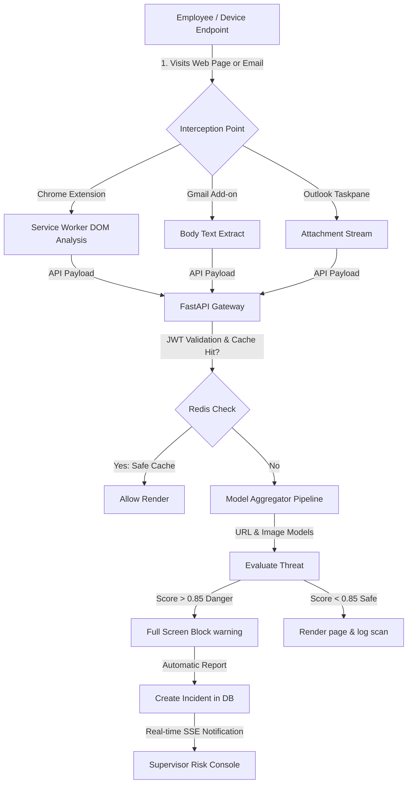
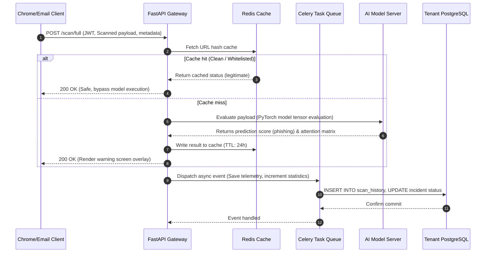

# 🛡️ AegisOne: System Architecture Specification (HLD & LLD)

This document provides the complete **High-Level Design (HLD)** and **Low-Level Design (LLD)** for the **AegisOne** multi-tenant, multi-modal phishing detection and prevention platform.

---

## 1. System Overview & Technology Stack

AegisOne is an enterprise-grade cyber defense system designed to counter phishing across multiple vectors (URLs, emails, SMS text, and visual screenshots) using hybrid deep learning models. 

### Technology Stack Blueprint
```
┌──────────────────────────────────────────────────────────────────────────┐
│                             CLIENT TIER                                  │
│  ┌──────────────────────┐  ┌──────────────────────┐  ┌────────────────┐  │
│  │   Chrome Extension   │  │   Gmail / Outlook    │  │  Next.js Web   │  │
│  │    (Manifest V3)     │  │   Office Add-ins     │  │   Dashboard    │  │
│  └──────────┬───────────┘  └──────────┬───────────┘  └───────┬────────┘  │
└─────────────┼─────────────────────────┼──────────────────────┼───────────┘
              │ (HTTPS Telemetry / Scans)                      │ (JSON / SSE)
┌─────────────▼─────────────────────────▼──────────────────────▼───────────┐
│                          API ORCHESTRATION TIER                          │
│  ┌────────────────────────────────────────────────────────────────────┐  │
│  │                 FastAPI Gateway (Uvicorn / ASGI)                   │  │
│  │   - JWT / OAuth2 Auth  - Rate Limiting     - Router Orchestrator   │  │
│  └──────┬──────────────────────────────┬────────────────────────┬─────┘  │
│         │ (Model Inquiries)            │ (Task Broker)          │        │
│         ▼                              ▼                        │        │
│  ┌──────────────┐              ┌──────────────┐                 │        │
│  │ Redis Cache  │              │ Celery Task  │                 │        │
│  │  (URL / DOM) │              │    Queue     │                 │        │
│  └──────────────┘              └──────┬───────┘                 │        │
└───────────────────────────────────────┼─────────────────────────┼────────┘
                                        │ (Async Telemetry Logs)  │
┌───────────────────────────────────────▼─────────────────────────┼────────┐
│                          DATA STORAGE TIER                      │        │
│  ┌────────────────────────────────────────────────────────────┐ │        │
│  │             PostgreSQL Multi-Tenant Instance               │◄┼────────┘
│  │  - Global Config    - Tenant Partitioning   - Scans & Logs │  │
│  └────────────────────────────────────────────────────────────┘  │
└──────────────────────────────────────────────────────────────────┼───────┘
                                                                   │ (PyTorch Tensors)
┌──────────────────────────────────────────────────────────────────▼───────┐
│                           AI INFERENCE TIER                              │
│  ┌────────────────────────────────────────────────────────────────────┐  │
│  │                    Model Inference Engine (PyTorch)                │  │
│  │  ┌──────────────────┬──────────────────┬────────────────────────┐  │  │
│  │  │    URL Model     │   Email Model    │      Image Model       │  │  │
│  │  │ BERT+Feature MLP │ DistilBERT+LSTM  │  EfficientNet-B3 + SE  │  │  │
│  │  └──────────────────┴──────────────────┴────────────────────────┘  │  │
│  └────────────────────────────────────────────────────────────────────┘  │
└──────────────────────────────────────────────────────────────────────────┘
```

---

## 2. Access Control & Role Boundaries

AegisOne utilizes a strict, multi-tenant hierarchy mapped across 4 distinct levels of authorization:

| Tier | Role | Organization Scope | Data Boundaries | Principal Capabilities |
| :--- | :--- | :--- | :--- | :--- |
| **Tier 0** | **Platform Head** *(Global Admin)* | Cross-tenant global view | Aggregated system telemetry, system logs, metadata. **Anonymized** raw texts. | Deploy client databases, configure global models, view platform-wide load. |
| **Tier 1** | **Super Admin** *(Org Admin)* | Single Tenant Organization | All organization users, supervisors, department metrics, incidents, audits. | Create/decommission Supervisor and User accounts, modify local policies. |
| **Tier 2** | **Supervisor** *(Dept Head)* | Single Department | Filtered metrics, logs, and incidents relating to their team. | Add/remove employees from active shift rosters, resolve department incidents. |
| **Tier 3** | **Employee** *(End User)* | Individual Level | Personal scan history, manual scanning inputs, custom alert logs. | Run manual URL/Email scans, report suspicious files, monitor personal safety. |

---

## 3. High-Level Architecture (HLD)

### 3.1. Client-Side Telemetry & Interception
* **Chrome Extension (Manifest V3)**:
  * **Content Script**: Injected dynamically into active browser tabs. Hooks URL clicks and DOM mutation events. Performs local regex pre-filtering of sensitive inputs.
  * **Service Worker (Background)**: Listens for content script extraction messages, checks the local Redis cache via API, and intercepts phishing redirects. If a page remains open for more than 2 seconds, it invokes `chrome.tabs.captureVisibleTab` to execute visual analysis.
  * **DOM Injector**: Overlays active pages with a full-screen CSS blocking warning if the visual or text models return threat probabilities $> 0.85$.
* **Third-Party Email Plugins (Gmail/Outlook)**:
  * **Gmail Add-on (Google Apps Script)**: Intercepts email opening, extracts RFC 2822 headers, and sends text body payloads to the central backend.
  * **Outlook Add-in (Office JS / React)**: Embedded as a taskpane. Monitors the selected item in the active explorer and routes attachments (extracted PDFs/ZIP files) directly for deep parsing.

### 3.2. Orchestration & Asynchronous Workers
* **FastAPI Gateway**: Serves as the system router. Authenticates requests via HTTP Bearer JWT tokens. It runs parallel async model inference using:
  ```python
  predictions = await asyncio.gather(
      scan_url(url_payload),
      scan_email(email_payload),
      scan_image(image_payload)
  )
  ```
* **Celery Background Workers**: Non-blocking telemetry ingestion queues. When the extension reports page navigation logs, FastAPI responds instantly with a `202 Accepted` status, handing off the persistent database write and trend calculation to a Celery worker backed by Redis.

---

## 4. Low-Level Architecture (LLD)

### 4.1. AI Deep Learning Classifiers

#### A. Email Phishing Classifier
* **Pipeline Structure**: Hybrid Semantic-Structural Neural Network.
* **Text Branch**:
  * Tokenizer: `DistilBertTokenizer` (512 tokens max).
  * Feature Extractor: `distilbert-base-uncased` with LoRA Adapters ($r=16, \alpha=32$).
  * Sequence Modeling: Bidirectional LSTM (Input: 768, Hidden: 256, Output: 512).
  * Attention Layer: `MultiHeadAttentionPool` (8 heads, hidden size 512) for computing explainable attention weights mapped to individual tokens in the UI.
* **Structural Branch**:
  * Evaluates 10 handcrafted features (URL counts, capital ratios, subject exclamation frequencies, HTML tags, phishing keywords).
  * Structured MLP: `Linear(10, 64) -> BatchNorm -> ReLU -> Dropout(0.2) -> Linear(64, 32) -> ReLU`.
* **Output Classification Head**:
  * Concatenation layer ($512 + 32 = 544$).
  * Dense Classifier: `Linear(544, 128) -> ReLU -> Dropout(0.3) -> Linear(128, 1) -> Sigmoid`.

#### B. Visual Screenshot Classifier
* **Pipeline Structure**: Transfer Learning CNN with SE Channel Attention.
* **Backbone**: EfficientNet-B3 (Pretrained on ImageNet).
* **Classifier Head**:
  * `Dropout(0.4) -> Linear(1536, 512) -> BatchNorm -> ReLU -> SEBlock(reduction=16) -> Dropout(0.2) -> Linear(512, 128) -> BatchNorm -> ReLU -> Linear(128, 2) -> Softmax`.
* **Training / Fine-Tuning**: Staged unfreezing. Classifier head is trained first, followed by the final 4 layers of EfficientNet-B3, and finally full-network optimization using Mixup augmentation and label smoothing ($0.05$).

---

### 4.2. Database Schema Design (PostgreSQL)

```sql
-- Multi-Tenant Organizations
CREATE TABLE organizations (
    id VARCHAR(50) PRIMARY KEY,
    name VARCHAR(100) NOT NULL,
    domain VARCHAR(100) UNIQUE NOT NULL,
    plan VARCHAR(30) DEFAULT 'Enterprise',
    node_url VARCHAR(255),
    created_at TIMESTAMP WITH TIME ZONE DEFAULT CURRENT_TIMESTAMP
);

-- User Profiles
CREATE TABLE users (
    id VARCHAR(50) PRIMARY KEY,
    organization_id VARCHAR(50) REFERENCES organizations(id) ON DELETE CASCADE,
    email VARCHAR(100) UNIQUE NOT NULL,
    password_hash VARCHAR(255) NOT NULL,
    full_name VARCHAR(100) NOT NULL,
    role VARCHAR(30) NOT NULL, -- 'global_admin', 'super_admin', 'office_admin', 'employee'
    department VARCHAR(50) DEFAULT 'General',
    created_at TIMESTAMP WITH TIME ZONE DEFAULT CURRENT_TIMESTAMP
);

-- Scan Telemetry Log
CREATE TABLE scan_history (
    id VARCHAR(50) PRIMARY KEY,
    user_id VARCHAR(50) REFERENCES users(id) ON DELETE SET NULL,
    organization_id VARCHAR(50) REFERENCES organizations(id) ON DELETE CASCADE,
    scan_type VARCHAR(20) NOT NULL, -- 'url', 'email', 'text', 'image'
    input_preview TEXT NOT NULL,
    prediction VARCHAR(30) NOT NULL, -- 'legitimate', 'phishing', 'malicious'
    phishing_probability NUMERIC(5,4) NOT NULL,
    risk_level VARCHAR(20) NOT NULL, -- 'safe', 'suspicious', 'danger'
    xai_explanation TEXT,
    source VARCHAR(50) NOT NULL, -- 'extension', 'gmail', 'outlook', 'dashboard'
    scanned_at TIMESTAMP WITH TIME ZONE DEFAULT CURRENT_TIMESTAMP
);

-- Threat Mapping Index
CREATE TABLE threat_map (
    id SERIAL PRIMARY KEY,
    indicator_value VARCHAR(512) NOT NULL, -- hashed/normalized url or domain
    indicator_type VARCHAR(20) NOT NULL, -- 'domain', 'url', 'sha256'
    reported_by_org VARCHAR(50) REFERENCES organizations(id) ON DELETE SET NULL,
    verified BOOLEAN DEFAULT FALSE,
    created_at TIMESTAMP WITH TIME ZONE DEFAULT CURRENT_TIMESTAMP
);

-- Incident Management Queue
CREATE TABLE incidents (
    id VARCHAR(50) PRIMARY KEY,
    reported_by VARCHAR(50) REFERENCES users(id) ON DELETE CASCADE,
    organization_id VARCHAR(50) REFERENCES organizations(id) ON DELETE CASCADE,
    details TEXT NOT NULL,
    status VARCHAR(30) DEFAULT 'open', -- 'open', 'investigating', 'resolved'
    assigned_to VARCHAR(50) REFERENCES users(id),
    created_at TIMESTAMP WITH TIME ZONE DEFAULT CURRENT_TIMESTAMP
);
```

---

## 5. Flow Structures

### 5.1. User Flow Diagram (Logical Actions)


### 5.2. Information Lifecycle (Telemetry Engine)


---

## 6. AI Diagram Generation Prompts

These text prompts are structured with explicit layout coordinates, stylistic specifications, and connection types to enable high-fidelity diagram generation using AI tools (such as Eraser.io, DALL-E, or Mermaid engines).

### Prompt 1: High-Level System Architecture Diagram
> **Target Tool**: Eraser.io / Architectural Diagram Generators
> **Description**: Draw a vertical, multi-layered enterprise architecture diagram for a system named "AegisOne Phishing Prevention Platform". Use a dark color palette consisting of dark charcoal slate backgrounds (#0f172a), deep blue connectors (#2563eb), and vibrant neon green accents (#10b981) for secure pipelines.
> The diagram must contain 4 distinct vertical tiers, top to bottom:
> 1. "Client Tier" (Left to Right): Chrome Extension (Manifest V3), Gmail Add-on, Outlook Add-in, Next.js Web Dashboard. Each client card should have a small icon indicator.
> 2. "API & Orchestration Tier": A wide central panel named "FastAPI Gateway Server". Draw a sub-connection to a "Redis Caching Node" on the left, and a "Celery Task Broker" on the right.
> 3. "AI Inference Cluster": Three parallel modules labeled "Semantic URL Classifier (BERT)", "Email Hybrid Classifier (DistilBERT + Bi-LSTM)", and "Screenshot Analyzer (EfficientNet-B3)".
> 4. "Data Storage & Telemetry Tier": A cylindrical database icon representing "Multi-Tenant PostgreSQL Instance". Connect the Next.js Dashboard to this database directly for analytics, and Celery workers to this database for background log writing.
> Use solid lines with directional arrowheads to denote HTTP traffic flow, and dashed lines for asynchronous background queues.

### Prompt 2: Detail Sequence Diagram (Information Flow & Detection lifecycle)
> **Target Tool**: Mermaid.js Parser / Sequence Visualizer
> **Description**: Create a sequence diagram showing a real-time URL detection sequence. The participants are:
> - Client: User's Chrome browser with AegisOne Extension
> - Gateway: FastAPI routing backend
> - Redis: Cache server
> - Models: PyTorch Deep Learning server
> - Telemetry: Celery background workers
> - Database: Tenant SQL DB
> The flow must follow these steps:
> 1. Client sends a POST request with headers and URL metadata to the Gateway.
> 2. Gateway checks the Redis cache for an existing scan result matching the URL hash.
> 3. If Redis hits, return the result directly. If it misses, Gateway sends the URL and DOM elements to the PyTorch Model server.
> 4. The Models server returns a phishing probability score of 0.92 and an explainable AI token checklist.
> 5. Gateway writes the result to Redis with a 24-hour expiration token.
> 6. Gateway responds to the Client with a blocked status indicator, triggering the extension to render a red screen warning.
> 7. Concurrently, Gateway posts a task to the Celery worker queue to log the threat incident.
> 8. The Celery worker updates the PostgreSQL database tables.
> Use clear grouping blocks, activation lifelines on participants, and distinct arrow styles for sync and async requests.

### Prompt 3: Detailed Database E-R Diagram (Multi-Tenant Schema)
> **Target Tool**: dbdiagram.io / Eraser DB Visualizer
> **Description**: Generate an entity-relationship diagram representing a clean PostgreSQL schema with 5 tables:
> 1. `organizations`: columns `id` (PK, varchar), `name` (varchar), `domain` (varchar, unique), `plan` (varchar), `node_url` (varchar), `created_at` (timestamp).
> 2. `users`: columns `id` (PK, varchar), `organization_id` (FK referencing organizations.id), `email` (varchar, unique), `password_hash` (varchar), `full_name` (varchar), `role` (varchar), `department` (varchar), `created_at` (timestamp).
> 3. `scan_history`: columns `id` (PK, varchar), `user_id` (FK referencing users.id), `organization_id` (FK referencing organizations.id), `scan_type` (varchar), `input_preview` (text), `prediction` (varchar), `phishing_probability` (numeric), `risk_level` (varchar), `xai_explanation` (text), `source` (varchar), `scanned_at` (timestamp).
> 4. `threat_map`: columns `id` (PK, serial), `indicator_value` (varchar), `indicator_type` (varchar), `reported_by_org` (FK referencing organizations.id), `verified` (boolean), `created_at` (timestamp).
> 5. `incidents`: columns `id` (PK, varchar), `reported_by` (FK referencing users.id), `organization_id` (FK referencing organizations.id), `details` (text), `status` (varchar), `assigned_to` (FK referencing users.id), `created_at` (timestamp).
> Draw clear 1-to-many relationship lines between organizations and users, users and scan_history, organizations and scan_history, users and incidents, and organizations and incidents.
