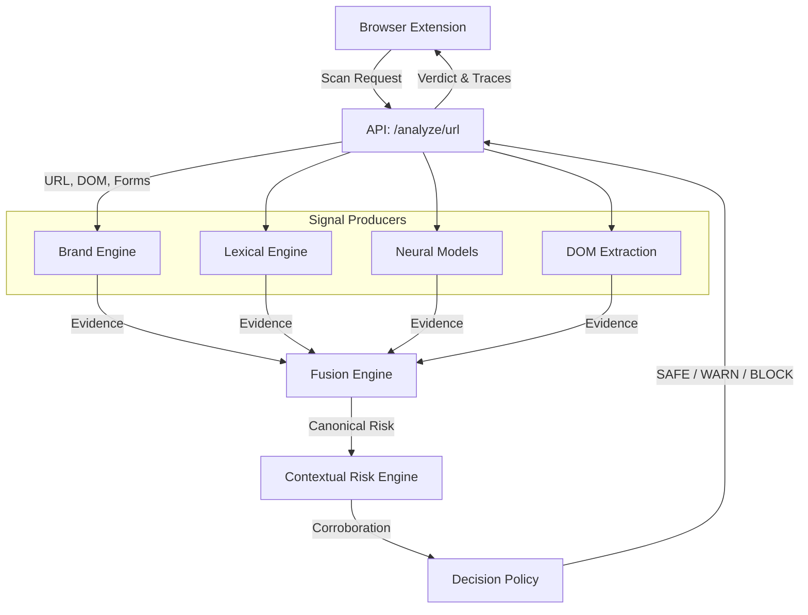

# AegisOne Architecture

AegisOne operates as a multimodal phishing detection pipeline. The architecture is designed to fuse lightweight heuristic checks with deep neural network inference, ensuring maximum performance while retaining high-fidelity risk analysis.

## Execution Flow

## Component Boundaries

1. **Model Orchestrator (`model_orchestrator.py`)**: Coordinates the signal producers. It guarantees that all independent modalities are executed, but it **does not** generate the final risk decision.
2. **Signal Producers**: Lexical extractors, brand homoglyph normalizers, and DistilBERT neural models compute probabilistic evidence and identify distinct anomalies.
3. **Fusion Engine**: Aggregates disparate signals into a unified raw risk score.
4. **Contextual Risk Engine**: Evaluates evidence corroboration. For example, a high URL risk is corroborated if a password input form is detected on the page.
5. **Decision Policy (`decision_policy.py`)**: The single canonical authority that converts final evidence and risk thresholds into a `SAFE`, `WARN`, or `BLOCK` verdict.
