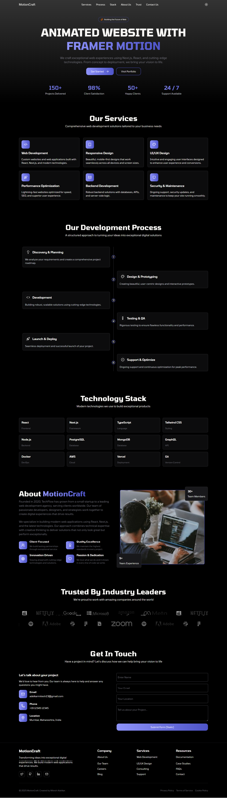

# ✨ MotionCraft - React and Framer Motion

### About this Project:
MotionCraft is a React.js-based website built to explore and experiment with Framer Motion animations. The main goal behind creating this project was to understand how to bring life to different sections of a webpage through smooth and engaging motion effects.

The content on the website was generated using ChatGPT — simply to fill the layout and visualize the design in context. The inspiration for MotionCraft came from a mix of modern company landing pages, blending minimal design with clean transitions.

### Tech Stack used:

### Live Demo Link:
https://framer-motion-craft.netlify.app

### Project Screenshot:
